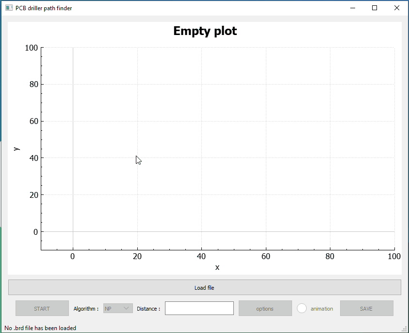

# PCB Driller Path Optimizer (TSP Solver)


+⚠️ **Note:** This project is currently under active refactoring.  
+Some parts of the codebase are being restructured for better maintainability (splitting algorithms, model, and UI).  
+
+This project is a **PCB drilling path optimizer** that uses different algorithms for the [Traveling Salesman Problem (TSP)](https://en.wikipedia.org/wiki/Travelling_salesman_problem).  


This project is a **PCB drilling path optimizer** that uses different algorithms for the [Traveling Salesman Problem (TSP)](https://en.wikipedia.org/wiki/Travelling_salesman_problem).  
The tool reads **EAGLE `.brd` files**, extracts drill hole coordinates, and computes an efficient path for the CNC drill head.

It comes with a simple **Qt GUI** (using [QCustomPlot](https://www.qcustomplot.com/)) to visualize the points and the computed drilling path.

---

## ✨ Features
- Load drill hole coordinates from **Eagle `.brd` files**
- Multiple TSP algorithms implemented:
  - **NP** – Natural permutation (baseline order)
  - **NN** – Nearest Neighbor
  - **SA** – Simulated Annealing
  - **2-opt** – Local optimization
- Interactive **plot visualization** of points and optimized paths
- Progress bar and optional step-by-step animation (for 2-opt and SA)
- Save results (ordered drilling coordinates) to a text file

---

## 🖼️ Screenshots / Demo
Example visualization of drilling points and computed path:



---

## 🚀 Usage
1. Start the application.
2. Load a `.brd` file using **Load** button.
3. Select an algorithm from the **Algorithm dropdown**:
   - NP, NN, SA, or 2-opt.
4. Click **Start** to compute the path.
5. Visualize the result in the plot.
6. Save the computed path to a text file.

---

## 🛠️ Build Instructions

### Requirements
- **Qt 5 or Qt 6** (with Widgets & Core modules)
- C++17 or newer
- [QCustomPlot](https://www.qcustomplot.com/) (included in the project or add manually)

### Build (CMake example)
```bash
git clone https://github.com/your-username/pcb-driller-tsp.git
cd pcb-driller-tsp
mkdir build && cd build
cmake ..
make